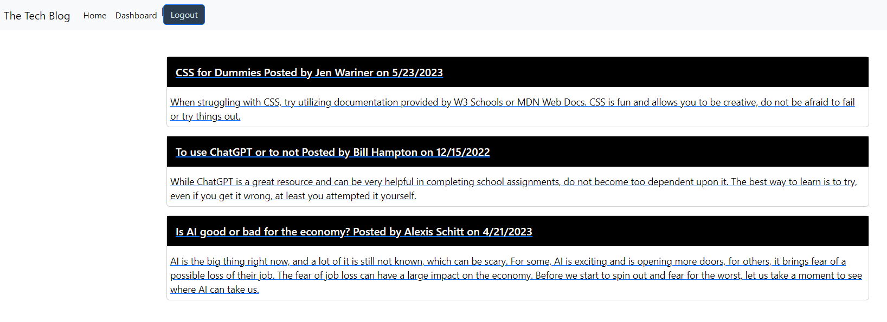

# Tech Blog

## Description 
A tech blog site that utilizes MVC for its structure and handlebars as the template language. Users must login to view the dashboard, create a blog, update a blog, or leave a comment on a blog. Deployed app using heroku.

## Table of Contents
1. [Installation](#installation)
2. [Usage](#usage)
3. [Contributing](#contributing)
4. [Tests](#tests)
5. [License](#license)
6. [Questions](#questions)

## Installation
You can view the app [here](https://jw-tech-blog.herokuapp.com/).

## Usage
Open the app and login to: view blog posts, create a post, comment on a post, update a post, or delete a post. 
  

## Contributing
N/A

## Tests
N/A

## License
Licensed under the [MIT license](https://opensource.org/license/mit/)

## Questions
You can view my GitHub repository here: [JenWariner19/tech-blog](https://github.com/JenWariner19/tech-blog) 
If you have any questions and would like to contact me, you can email me at: [jenniferwariner@yahoo.com](mailto:jenniferwariner@yahoo.com)# tech-blog